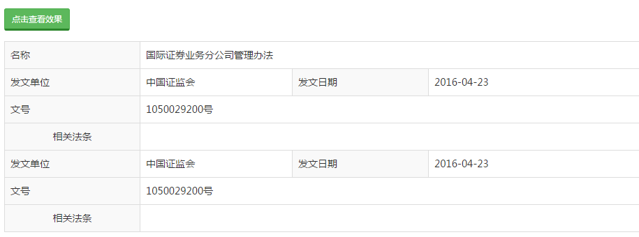

# 打印组件

## 示意图


## 依赖
```html
jQuery
bootstrap
NerisUI
```

## 页面引入
```html
<!-- 打印组件 -->
<link href="../static/neris-widget/print/1.18/css/neris.print.css" rel="stylesheet" media="print">
<script src="../static/neris-widget/print/1.18/js/neris.print.js"></script>
```
## 方法调用
```html
<script type="text/javascript">
$(".btn-click-result").click(function(){
    $(".table").print({
		globalStyles : true,
		title : "打印测试",
		timeout : 750
	});
});
</script>
```
```html
<button class="btn btn-success btn-sm btn-click-result" type="button">打印</button>
<table class=table></table>
```
>**说明：**`options`是组件初始化配置的参数对象，具体见下方参数配置说明。

## options参数说明 

|参数名称|类型|必填|默认值|描述|
|-------|--------|---------|---------|--------------|
|globalStyles|Boolean|否&nbsp;&nbsp;&nbsp;&nbsp;&nbsp;&nbsp;|true&nbsp;&nbsp;&nbsp;&nbsp;&nbsp;&nbsp;&nbsp;&nbsp;&nbsp;|父文档的样式是否应该被包含|
|title|String|否|''	|打印文件的标题|