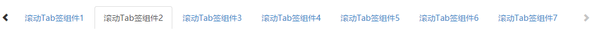

# 滚动Tab签组件

## 示意图


## 依赖
```html
jQuery
bootstrap
NerisUI
```

## 页面引入
```html
<!-- css -->
<link href="../static/bootstrap/3.3.0/css/bootstrap.min.css" rel="stylesheet">
<link href="../static/neris-ui/1.9.2/css/style.css" rel="stylesheet">
<link href="../static/neris-widget/tabroll/1.18/css/neris.tabroll.css" rel="stylesheet">
<!-- 引入的UI规范js文件 -->
<script src="../static/jquery/1.11.1/jquery.min.js"></script>
<script src="../static/bootstrap/3.3.0/js/bootstrap.min.js"></script>
<!-- 滚动Tab签组件 -->
<script src="../static/neris-widget/tabroll/1.17/js/neris.tabroll.js"></script>
```
## 方法调用
```html
<script type="text/javascript">
	$(function(){
		$("#nerisRroll").nerisRollTabs(options);
	});
</script>
```
```html
<div id="nerisRroll"></div>
```
>**说明：**`options`是组件初始化配置的参数对象，具体见下方参数配置说明。

## options参数说明 

|参数名称|类型|必填|默认值|描述|
|-------|--------|---------|---------|--------------|
|count|Number|否&nbsp;&nbsp;&nbsp;&nbsp;&nbsp;&nbsp;|1&nbsp;&nbsp;&nbsp;&nbsp;&nbsp;&nbsp;&nbsp;&nbsp;&nbsp;|一次滚动的tab签个数|
|tabs|Array|是|''	|数组用于设置每个显tab签的配置信息|

## tabs包含如下属性： 

|参数名称|类型     |必填     |默认值    |描述          |
|-------|--------|---------|---------|--------------|
|id|	String|	否	|''|可配置每个tab签的id属性|
|tName|	String| 是	|''&nbsp;&nbsp;&nbsp;&nbsp;&nbsp;&nbsp;&nbsp;&nbsp;|Tab签的显示的名字|
|html|	String|	否	|''|对应标签的内容|
|callback|	Function|	否	|''|Tab签点击事件的回调函数|