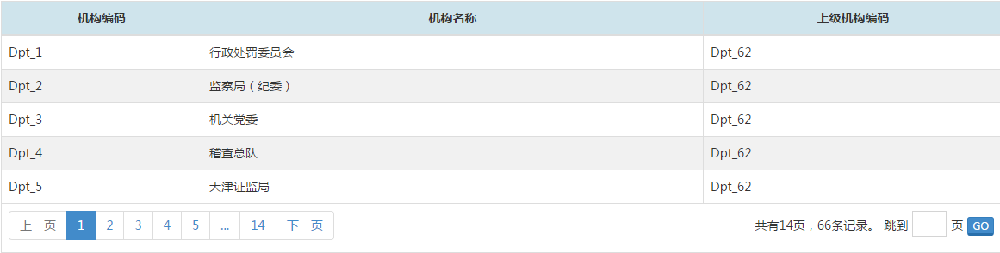

# 分页组件

## 示意图


## 组件依赖 
```html
jQuery
bootstrap
NerisUI
```
<!-- 组件页面引入开始 -->

## 页面引入
可以像下面代码在你的页面上调用它
```html
<!-- 引入的UI规范css文件 -->
<link href="../static/bootstrap/3.3.0/css/bootstrap.min.css" rel="stylesheet">
<link href="../static/neris-ui/1.8.0/css/style.css" rel="stylesheet">
<!-- 引入的UI规范js文件 -->
<script src="../static/jquery/1.11.1/jquery.min.js"></script>
<script src="../static/bootstrap/3.3.0/js/bootstrap.min.js"></script>
<!-- 弹出框组件 -->
<script src="../static/neris-widget/dialog/1.17/js/neris.dialog.js"></script>
<!-- 引用的分页组件文件-->
<script src="../static/neris-widget/pagination/1.17/js/neris.pagination.js"></script>
```
## 方法调用
```html
<script type="text/javascript">
	$(function() {
		$('#nerisPage').nerisPagination(settings);
	});
</script>
```
```html
<div id="nerisPage"></div>
```
>**说明：**`settings`是组件初始化配置的参数对象，具体见下方参数配置说明。


## settings 参数说明 
|参数名称|  类型  | 必填  |   默认值     |      描述      |
| ------|-------|-----------|------|------|
|url|String|是| `''` |请求远程数据地址|
|pageSize|Number|否| `15` |每页显示条数|
|currentPage|Number|否| `1` |指定当前页|
|param|Object|否	| `''` |查询附加参数：`{"cDeptNme" : 行政处罚委员会, "cPrntNme" : 中国证券监督管理委员会}` |
|success|Function|否	| `''` |回调该函数时作为参数传回的数据。 例如：`var renderTable = function(data){//显示数据的表格}` |


