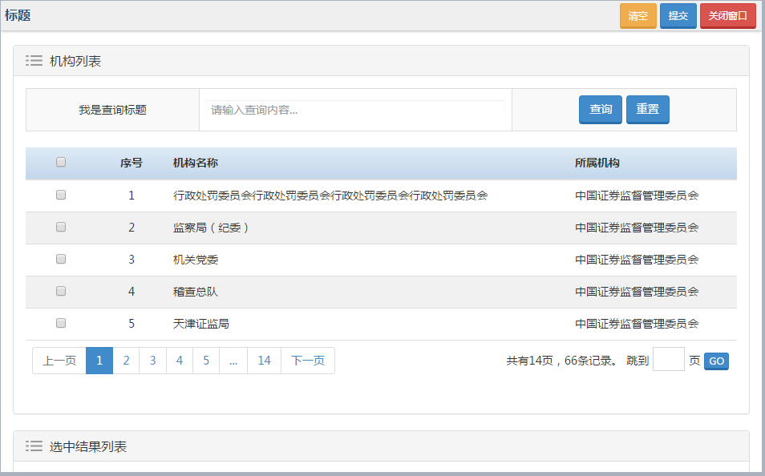

#部门分类多页选择组件

## 示意图

## 依赖
```html 
neris.pagination.js //分页组件
neris.dialog.js //弹出框组件
jquery.textSearch-1.0.js //第三方关键字高亮插件
```

## 页面引入
父页面。调用以下代码，调用之前请先引入 ```neris.unitselect-mpage.js``` 文件：

```html
<script type="text/javascript">
	var yourMethod = function(callbackData) {
	     /**
	      * callbackData是你所选择后的数组对象
	      * 根据返回的数据处理你自己的业务逻辑代码
	      */
	}
	$(function() {
	     addCenterWindow("/subpage?handleFun=yourMethod&otherParams=someValue", "selectUnits", 600, 950);
	});
</script>
```

## 

> **注意** <br>方法：<br>
——addhCenterWindow(url, id, height, width)：调用方法加载子页面实现组件初始化工作。<br>
参数：<br>
——url: 指向子页面的映射路径，get请求。可在url路径后面传递参数，例如：/subpage?selectType=multi。<br>
——id: 唯一标识，最终会自动在div容器中生成这个id。<br>
——height: 窗口高度，int类型。<br>
——width: 窗口宽度，int类型。


子页面

```html 
<!-- 引入弹出框组件 -->
<script src="../static/neris-widget/dialog/1.20/js/neris.dialog.js"></script>
<!-- 引入分页组件 -->
<script src="../static/neris-widget/pagination/1.17/js/neris.pagination.js"></script>
<!-- 引入查询高亮显示组件 -->
<script src="../static/neris-widget/textSearch/1.0/js/jquery.textSearch-1.0.js"></script>
<!-- 引入部门分类多页选择组件 -->
<script src="../static/neris-widget/unitselect-mpage/1.24/js/neris.unitselect-mpage.js"></script> 
```

## 方法调用
```html
<script type="text/javascript">
	$(function(){
		$.selectUnits.initMultiPage(settings);
	});
</script>
```


> 提示： settings: 是组件初始化参数配置对象，具体见下方参数配置。

## settings参数说明

### title
- ** 类型 :** `String`
|** 必填 :** `否`
|** 默认值 :** `'title'`
- ** 描述 :** `标题`

### echoId
- ** 类型 ：**	`String` 
	|** 必填 ：**	`否`
	|** 默认值 ：**	`'id'`
- ** 描述 ：** `数据唯一标识（等同数据库中表的主键）`

### searchTitle
- ** 类型 ：**	 `String`
	|** 必填 ：**	`否`
	|** 默认值 ：**	`'Search'`
- ** 描述 ：** `查询标题`

### selectType
- ** 类型 ：**	 `String`
	|** 必填 ：**	`否`
	|** 默认值 ：**	`'multi'`
- ** 描述 ：** `选择模式。 'multi': 多选 ； 'single': 单选`

### pageSize
- ** 类型 ：** `Number`
	|** 必填 ：**	`否`
	|** 默认值 ：**	`5`
- ** 描述 ：** `每页显示条数`

### url
- ** 类型 ：** `String`
|** 必填 ：** `是`
|** 默认值：** `''`
- ** 描述 ：** `异步数据请求url`

### columns
- ** 类型 ：** `Array`
	|** 必填 ：**	`是`
	|** 默认值 ：**	`[]`
- ** 描述 ：** `指定显示列，例如：`
```html
columns: [
	{title: ‘机构名称’, data: ‘cdeptNme’},
	{title: ‘所属机构’, data: ‘cPrntNme’}
]
```

### showIndex
- ** 类型 ：**  `Boolean` 
	|** 必填 ：**	`否`
	|** 默认值 ：**	`true`
- ** 描述 ：** `是否显示序号`

### showPrompt
- ** 类型 ：**	 `Boolean`
	|** 必填 ：**	`否`
	|** 默认值 ：**	`true`
- ** 描述 ：** `是否显示列提示文字`

### isEcho
- ** 类型 ：**	 `Boolean`
	|** 必填 ：**	`否`	
	|** 默认值 ：**	`true`
- ** 描述 ：** `是否回显`

### placeholder
- ** 类型 ：**	 `String`
	|** 必填 ：**	`否`
	|** 默认值 ：**	`''`
- ** 描述 ：** `查询文本框提示信息`

### dataBindId
- ** 类型 ：**	`String`|** 必填 ：**	`否`| ** 默认值 ：**	`''`
- ** 描述 ：** `数据绑定到父页面指定元素上（主要用来回显）。如果 `isEcho = true`，则该参数必须设置。`

### container
- ** 类型 ：**	`String` |** 必填 ：**	`否`|** 默认值 ：**	`''`
- ** 描述 ：** `容器。生成的页面内容都放到这个容器中。如果不指定则放到当前页面的`body`中`

### handleFun
- ** 类型 ：**	 `String`| ** 必填 ：**	`是`|** 默认值 ：**	`''`
- ** 描述 ：** `父页面自定义方法名。例如：`
```html
<script type="text/javascript">
	var yourMethodName = function(callbackData) {
		/**
		 * 这里实现你自己的业务逻辑代码
		 *callbackData：是你选择的数据。
		*/
	}
</script>
```

### showDatas
- ** 类型 ：**	 `Array`|** 必填 ：**	`否`|** 默认值 ：**	`[]`
- ** 描述 ：** `数据回显。回显的数据需要用户从保存的数据库中查询，其中传入参数ID为必要参数，其他可根据用户需求自行配置为了使回显正常显示，数组中每个对象的属性请保持和 url 返回的对象属性一致。例如：`

```html
$.selectUnits.initMultiPage({
	...
	showDatas: [// 数组对象。
		{id : '1' ,cPnme: '机构名字', cOrganme: '所属机构', ...},  
		...
	] 
	...
});
```

## 对外提供的方法说明

### 清空方法
- ** 调用方式 :**  ```$.selectUnits.clearMultiPageDatas();```
- ** 返回值 :**  	`无`
- ** 描述 ** `清空绑定到指定元素上的数据。`

### 删除方法
- ** 调用方式 :**  ```$.selectUnits.removeMultiPageDatas(key, value);```
- ** 返回值 :**  	无
- ** 描述 :** `根据对象中的某个属性删除绑定到指定元素上的一条数据。key: 对象中的某个属性value: key对应的值. 例如：// 删除id='1'记录`
```
$.selectUnits.removeMultiPageDatas('id', '1');
```

## 查询时发送到服务端的参数

|属性名	      |类型	 |描述     		|
|-------------|------|--------------|
|searchParam  |String|查询参数   	|
|pageSize	  |Number|每页显示条数	|
|pageNo	      |Number|当前页码		|