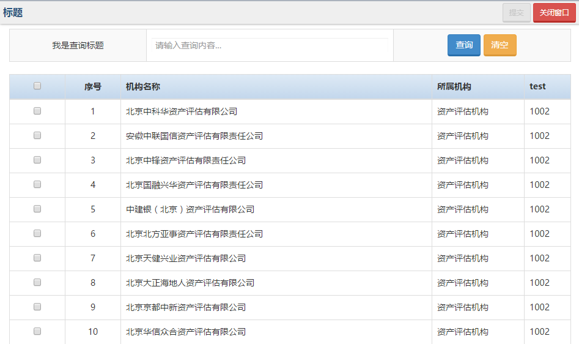

#部门分类单页选择组件

## 示意图


##页面引入

父页面。调用以下代码，调用之前请先引入```neris.unitselect-spage.js```文件：

```html
<script type="text/javascript">
	var yourMethod = function(callbackData) {
	     /**
	      * callbackData是你所选择后的数组对象
	      * 根据返回的数据处理你自己的业务逻辑代码
	      */
	}
	$(function() {
	    addCenterWindow("/subpage?handleFun=yourMethod&otherParams=someValue", "selectUnits", 600, 950);
	});
</script>
```


>**注意**：<br>
	方法：<br>
	——addhCenterWindow(url, id, height, width)：调用方法加载子页面实现组件初始化工作。<br>
	参数：<br>
	——url: 指向子页面的映射路径，get请求。可在url路径后面传递参数，例如：/subpage?selectType=multi。<br>
	——id: 唯一标识，最终会自动在div容器中生成这个id。<br>
	——height: 窗口高度，int类型。<br>
	——width: 窗口宽度，int类型。


子页面

```html
<!-- 引入部门分类单页选择组件 -->
<script src="../static/neris-widget/unitselect-spage/1.19/js/neris.unitselect-spage.js"></script>
```
## 方法调用
```html
<script type="text/javascript">
	$(function(){
		$.unitsSinglePage.init(settings);
	});
</script>
```

> **说明**： settings: 是组件初始化参数配置对象，具体见下方参数配置。

## settings参数说明
### title
- ** 参数类型 :**	`String`
	|** 是否必填 :**	`否`
	|** 参数默认值 :**	 `'title'`
- ** 参数描述 :**  `标题`

### searchTitle
- ** 参数类型 :**	`String`
	|** 是否必填 :**	`否`
	|** 参数默认值 :**	 `'Search'`
- ** 参数描述 :**	   `查询标题`

### selectType	
- ** 参数类型 :**	`String`
	|** 是否必填 :**	`否`
	|** 参数默认值 :**	 `'multi'`
- ** 参数描述 :**	  `选择模式。'multi': 多选 ； 'single': 单选`

### async	
- ** 参数类型 :**	`Object`
	|** 是否必填 :**	`是`
	|** 参数默认值 :**	 
```html
		async:{
			url:‘’,
			param:{} 
			}
```
- ** 参数描述 :**	`异步请求。 url: 数据源； param: 请求参数 `
	
	
### columns	
- ** 参数类型 :** `Array`
|** 是否必填 :** `是`
|** 参数默认值 :** `[]`
- ** 参数描述 :** `指定显示列，例如：`
```	html
	columns: [
		{title: ‘机构名称’, data: ‘cdeptNme’},
		{title: ‘所属机构’, data: ‘cPrntNme’}
	]
```

### isEcho	
- ** 参数类型 :** `Boolean`
|** 是否必填 :** `否`
	|** 参数默认值 :**	` true `	
- ** 参数描述 :** `是否回显`

### placeholder	
- ** 参数类型 :** `String`|** 是否必填 :** `否`	|** 参数默认值 :** `''`	
- ** 参数描述 :**  `查询文本框提示信息`

### dataBindId	
- ** 参数类型 :** `String`
	|** 是否必填 :**	`否`	
|** 参数默认值 :** `''`
- ** 参数描述 :** `数据绑定到父页面指定元素上（主要用来回显）`
	
### container	
- ** 参数类型 :** `String` 
	|** 是否必填 :**	```否```
	|** 参数默认值 :**	`''`	
- ** 参数描述 :** `容器。生成的页面内容都放到这个容器中。如果不指定则放到当前页面的body中`

### handleFun	
- ** 参数类型 :** `String` 
	|** 是否必填 :**	`是`
	|** 参数默认值 :** 	`''`
- ** 参数描述 :**	 `父页面自定义方法名，例如：`
```html
<script type="text/javascript">
	var yourMethodName = function(callbackData) {
		/**
		 * 这里实现你自己的业务逻辑代码
		 *callbackData：是你选择的数据。
		*/
	}
</script>
```

### showDatas	
- ** 参数类型 :** `Array` 
	|** 是否必填 :**	`否`
	|** 参数默认值 :**	`' []'` 
- ** 参数描述 :**	`数据回显。回显的数据需要用户从保存的数据库中查询。为了使回显正常显示，数组中每个对象的属性请保持和列表中的属性一致。`

```html

$.unitsSinglePage.init({
	...
	showDatas: [// 数组对象。
		{"id":"100241999","name":"北京中科华资产评估有限公司", ...},
		...
	] 
	...
})
```