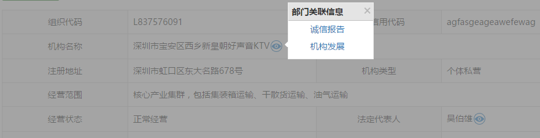


# 主体关联信息查询组件

## 示意图


## 依赖
```html
jQuery
bootstrap
NerisUI
```

## 页面引入
```html
<!-- 分页表格组件 -->
<script src="../static/neris-widget/popover/1.18/js/neris.popover.js"></script>
```
## 方法调用
```html
<script type="text/javascript">
	$(function(){
		$("#divId").nerisPopover(options);
	});
</script>
```
```html
<div id="divId"></div>
```
>**说明：**`options`是组件初始化配置的参数对象，具体见下方参数配置说明。

## options参数说明 
 
|参数名称|类型     |必填     |默认值    |描述       |
|-------|--------|---------|---------|--------------|
|mainTypeFlag|	String| 是	|''| '1' 是部门，'2' 是人员|
|listItems|	Object|	是	|''|关联列表项|
|title|	String|	否	|关联信息|弹出的关联签的标题|
|mask|	String|	否	|true|是否开启遮罩|

### 关联列表
#### 组织机构关联项
|列表项编号|列表项名称|参数名|
|-------|--------|---------|
|deptList01|诚信报告|queryType;queryCondition|

#### 人员关联项
|列表项编号|列表项名称|参数名|
|-------|--------|---------|
|personList01|诚信报告|queryType;queryCondition|

#### 关联项参数说明
|参数名| 参数类型| 说明 |
|-------|-------|-------|
|queryType|String&nbsp;&nbsp;&nbsp;&nbsp;&nbsp;&nbsp;|表示主体类型。“1”表示机构，“2”表示人员。|
|queryCondition|String |表示主体的名称或代码。可以是机构名称、组织机构代码、人员名称、人员身份证号。|

### 参数配置实例
```
	var options = {
		mainTypeFlag : '1',
		listItems  : {
			deptList01 : {
				queryType : '1',
				queryCondition : '123456789'
			}
		}
```