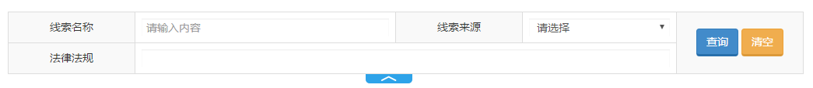

# 多行查询组件

## 示意图


## 依赖
```
jquery
bootStrap
nerisUI
vue.js
```

## 页面引入
```html
<!-- 引入的UI规范CSS样式 -->
<link href="../static/bootstrap/3.3.0/css/bootstrap.min.css" rel="stylesheet"/>
<link href="../static/neris-ui/1.8.0/css/style.css" rel="stylesheet"/>
          
<!-- 引入的UI规范JS文件 -->    
<script src="../static/jquery/1.11.1/jquery.min.js"></script>
<script src="../static/bootstrap/3.3.0/js/bootstrap.min.js"></script>
 
<!-- vue.js -->
<script src="../static/vue/1.0.28/vue.js"></script>
<!-- 查询组件 -->
<script src="../static/neris-widget/search/1.17/js/neris.search.js"></script>
```

## 组件用法
在你查询表单 `<form>` 的外面包一层 `div` ， 并为这个 div 添加 `data-ns-scope = ""` 属性。例如：
```html
<div data-ns-scope="neris-search-api">
 <form class="search_form">
	<!-- 你的查询条件 -->
 </form>
</div>
```

## 属性说明
### data-ns-scope
- **类型：** `String` | **是否必填：**`是` | **默认值：** `无`
- **描述：** 用来指定组件作用域，属性值必须保证唯一。通过该属性最终会为 div 生成一个相同值的id属性。
```html
<!-- 源代码 -->
<div data-ns-scope="xxx"></div>
<!-- 审查元素 -->
<div data-ns-scope="xxx" id="xxx"></div>
```
 
### data-expand
- **类型：**`Boolean` | **是否必填：**`否` | **默认值：**`false`
- **描述：**默认是否展开/隐藏。
```html
<!-- 展开 -->
<div data-expand="true"></div>
```
 
### data-hide-from
- **类型：**`Number` | **是否必填：**`否 `| **默认值：**`4`
- **描述：**设置从第几行开始隐藏，但不包含当前设定的行。例如：
```html
<!-- 隐藏第四行后的所有行 -->
<div data-hide-from = "4"></div>
```

### data-ignore
- **类型：**`Boolean` | **是否必填：**`否` | **默认值：**`无`
- **描述：**忽略某行。

> **注意：**`data-ignore` 是放在 `<tr>` 标签上的。有些业务系统查询条件有些行是默认隐藏的，当点击某个 `<a>` 链接才显示出来。
为了防止这种隐藏行与组件冲突，特别增加了此属性。